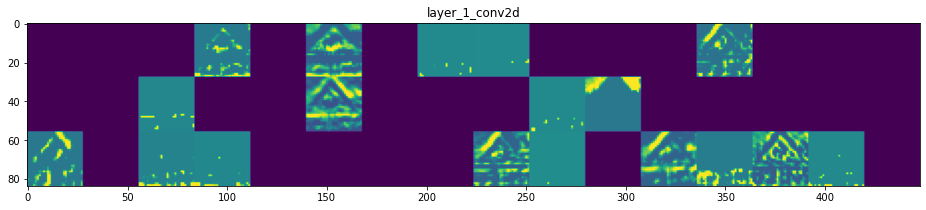

## Project: Build a Traffic Sign Recognition Program

This project is part of [Udacity](https://www.udacity.com)'s [Self-driving Car Engineer Nanodegree](https://www.udacity.com/course/self-driving-car-engineer-nanodegree--nd013) program. The goal of this proejct is build a Convolutional Neural Network (CNN) that recognizes traffic signs.

The goals / steps of this project are the following:
* Load the data set 
* Explore, summarize, and visualize the data set
* Design, train, and test a model architecture
* Use the model to make predictions on new images
* Analyze the softmax probabilities of the new images
* Summarize the results with a written report

Project output:
* All the code for this project is in the [Traffic_Sign_Classifier.ipynb](Traffic_Sign_Classifier.ipynb) notebook.
* The file [Traffic_Sign_Classifier.html](Traffic_Sign_Classifier.html) contains a HTML export of the notebook for online viewing.
* The project report is in [writeup.md](writeup.md).

My classifier has a validation accuracy of 97.43%, and correctly classifies 100% of the previously-unseen test images.

The [notebook](Traffic_Sign_Classifier.ipynb) provides more detail on the design of the CNN classifier, and the results.

### Running the code

The [Traffic_Sign_Classifier.ipynb notebook](Traffic_Sign_Classifier.ipynb) contains all the code for this project.

I used the following primary libraries:
* TensorFlow (version 2.5.0)
* Keras (version 2.4.3)
* OpenCV (version 4.5.1)
* numpy
* pandas
* matplotlib

The [requirements.txt](requirements.txt) contains a full listing of the dependencies I used, and can be usedto create a local virtual environment in which the notebook will run.

---

