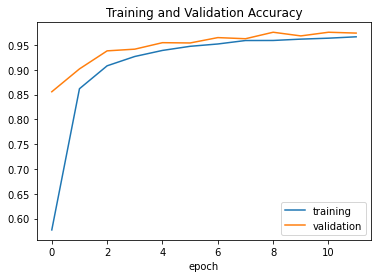
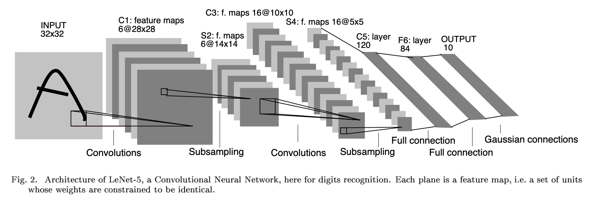
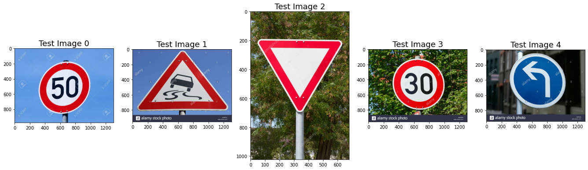
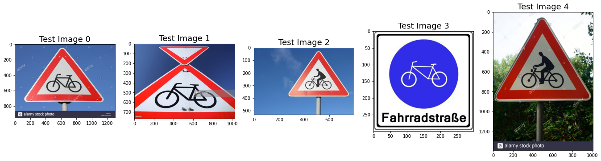

# Traffic Sign Recognition

## Writeup

### Build a Traffic Sign Recognition Project

The goals / steps of this project are the following:
* Load the data set (see below for links to the project data set)
* Explore, summarize and visualize the data set
* Design, train and test a model architecture
* Use the model to make predictions on new images
* Analyze the softmax probabilities of the new images
* Summarize the results with a written report


[//]: # (Image References)

[image1]: ./Images/writeup/bar_chart.png "Visualization"
[image2]: ./Images/writeup/graph.png "Graph of CNN classifier"
[image3]: ./Images/writeup/model_summary.png "Model Summary"
[image4]: ./data/traffic-signs-test-images/test1.jpg "Traffic Sign 1"
[image5]: ./data/traffic-signs-test-images/test2.jpg "Traffic Sign 2"
[image6]: ./data/traffic-signs-test-images/test3.jpg "Traffic Sign 3"
[image7]: ./data/traffic-signs-test-images/test4.jpg "Traffic Sign 4"
[image8]: ./data/traffic-signs-test-images/test5.jpg "Traffic Sign 5"
[image9]: ./Images/writeup/cnn_layers_viz.png "CNN Layers Visualization"

[image10]: ./Images/writeup/go_right_color.png "Go Right (Color)"
[image11]: ./Images/writeup/go_right_greyscale.png "Go Right (Greyscale)"
[image12]: ./Images/writeup/go_right_equalized.png "Go Right (Equalized)"


## Rubric Points

Here I will consider the [rubric points](https://review.udacity.com/#!/rubrics/481/view) individually and describe how I addressed each point in my implementation.  

---
### Writeup / README

#### 1. Provide a Writeup / README that includes all the rubric points and how you addressed each one. You can submit your writeup as markdown or pdf. You can use this template as a guide for writing the report. The submission includes the project code.

You're reading it! And here is a link to my [project code](Traffic_Sign_Classifier.ipynb).

### Data Set Summary & Exploration

#### 1. Provide a basic summary of the data set. In the code, the analysis should be done using python, numpy and/or pandas methods rather than hardcoding results manually.

I used the `pandas` library to calculate summary statistics of the traffic
signs data set:

* The size of training set is 34799
* The size of the validation set is 4410
* The size of test set is 12630
* The shape of a traffic sign image is (32, 32, 3)
* The number of unique classes/labels in the data set is 43

#### 2. Include an exploratory visualization of the dataset.

Here is an exploratory visualization of the data set. It is a bar chart showing how the data ...

![alt text][image1]

### Design and Test a Model Architecture

#### 1. Describe how you preprocessed the image data. What techniques were chosen and why did you choose these techniques? Consider including images showing the output of each preprocessing technique. Pre-processing refers to techniques such as converting to grayscale, normalization, etc. 

[Sermand and LeCun (2011)](#References) show that using greyscale images rather than color images can increase the accuracy of the classifier. Hence, I decided to convert the images to grayscale, and then equalize them. 

Here is an example of a traffic sign image before and after grayscaling, and with equalization applied:

Before | Grey | Equalized
:---:|:---:|:---:
![alt text][image10]|![alt text][image11]|![alt text][image12]


#### 2. Describe what your final model architecture looks like including model type, layers, layer sizes, connectivity, etc.) Consider including a diagram and/or table describing the final model.

Here is the final model summary:

![alt text][image3]


This graph, which I generated using the `keras_visualizer` library, shows the model layers in more detail:
 
![alt text][image2]


#### 3. Describe how you trained your model. The discussion can include the type of optimizer, the batch size, number of epochs and any hyperparameters such as learning rate.

I used these hyperparameters to tune my model:
```python
# hyperparameters - adjust these to obtain optimal performance
num_filters = 60 # more filters requires more computing power
filter_size = (5, 5) # set the size of our fitler to N x M
image_shape = (32,32,1)
pool_size = (2,2)
activation_function = 'relu'
hidden_layer_nodes = 500 # lower number is less accurate; higher number requires more computing power
dropout_rate = 0.5
```

I used the `Adam` optimizer with a learning rate of `0.001`:

```python
 # Complie the model
    model.compile(Adam(learning_rate=0.001), loss='categorical_crossentropy', metrics=['accuracy'])
```


#### 4. Describe the approach taken for finding a solution and getting the validation set accuracy to be at least 0.93. Include in the discussion the results on the training, validation and test sets and where in the code these were calculated. Your approach may have been an iterative process, in which case, outline the steps you took to get to the final solution and why you chose those steps. Perhaps your solution involved an already well known implementation or architecture. In this case, discuss why you think the architecture is suitable for the current problem.

My final model results scored a training set accuracy of 97.43%, as shown here:



I chose the LeNet-5 architecture ([LeCun, 1998](#References)), shown here, as a starting point for designing my classifier:



This CNN architecture was originally used for classifying hand-writren digits. I was able to use the same basic architecture, with some modifications (highlihgted in the [notebook](Traffic_Sign_Classifier.ipynb)) to classify traffic signs. My final CNN model architecture is [shown above](#design-and-test-a-model-architecture).

### Test a Model on New Images

#### 1. Choose five German traffic signs found on the web and provide them in the report. For each image, discuss what quality or qualities might be difficult to classify.

Here are five German traffic signs that I found on the web:



The Yield sign might be difficult to classify because the sign occupies only part of the image - trees occupy a lot of the background.

#### 2. Discuss the model's predictions on these new traffic signs and compare the results to predicting on the test set. At a minimum, discuss what the predictions were, the accuracy on these new predictions, and compare the accuracy to the accuracy on the test set (OPTIONAL: Discuss the results in more detail as described in the "Stand Out Suggestions" part of the rubric).

Here are the results of the prediction:

| Image			        |     Prediction	        					| 
|:---------------------:|:---------------------------------------------:| 
| Speed Limit (50km/hr) | Speed Limit (50km/hr) | 
| Slippery Road | Slippery Road |
| Yield | Yield |
| Speed Limit (30km/hr) | Speed Limit (30km/hr) |
| Turn left Ahead | Turn left Ahead |


The model was able to correctly guess 5 of the 5 traffic signs, which gives an accuracy of 100%. This compares favorably to the accuracy on the test set of 97.43%.

#### 3. Describe how certain the model is when predicting on each of the five new images by looking at the softmax probabilities for each prediction. Provide the top 5 softmax probabilities for each image along with the sign type of each probability. (OPTIONAL: as described in the "Stand Out Suggestions" part of the rubric, visualizations can also be provided such as bar charts)

The code for making predictions on my final model is located in the 11th cell of the Ipython notebook.

For the first image, the model is relatively sure that this is a stop sign (probability of 1.0), and the image does contain a Speed Limit (50km/hr) sign. The top five soft max probabilities were

Predicted Class | Probability
:--- | :---
Speed limit (50km/h) | 1.0
Speed limit (120km/h)  | 2.3358883e-08  
Speed limit (80km/h)  | 1.2955406e-08  
Speed limit (30km/h)  | 7.972085e-09   
Speed limit (60km/h) | 6.3156347e-09  


For the Turn Left image the Top 5 Softmax probabilities look like this:

Predicted Class | Probability
:--- | :---
Turn left ahead | 0.99039626     
Ahead only | 0.0045463196   
Speed limit (80km/h) | 0.0014993106   
No passing for vehicles over 3.5 metric tons | 0.0014847544   
Roundabout mandatory | 0.0011904315

The [notebook](Traffic_Sign_Classifier.ipynb) and [HTML output](Traffic_Sign_Classifier.html) contain the Top 5 softmax probabilities for all images.


#### 4. Example of where the model struggles: Bicycle Crossing signs

The training accuracy for the model was 97.43%, which still leaves some room for error. I noticed during training and testing the model that it performs poorly on bicycle crossing signs. I found these five images of bicycle crossing signs on the Web, and tested the classifer on them.



The results show that the classifier has difficulty classifying bicycle crossing signs correctly.
Looking at the Top 5 softmax probabilities for each sign: in this latest run only one of the images contain bicycle crossing in their Top 5 Softmax probabilities.

One factor here is the number of training samples. Looking at the dataset, bicycle crossing signs are among the signs with the fewest training images: 240 for bicycle crossing compared with 1980 and 2010 respectively for 30km/hr and 50km/hr traiffic signs. So, one remedy could be to use more training samples of bicycle crossing signs.

The [notebook](Traffic_Sign_Classifier.ipynb) has more details on this analysis.

### (Optional) Visualizing the Neural Network (See Step 4 of the notebook for more details)
#### 1. Discuss the visual output of your trained network's feature maps. What characteristics did the neural network use to make classifications?


Intermediate activations are _“useful for understanding how successive convnet layers transform their input, and for getting a first idea of the meaning of individual convnet filters”_ (Chollet, 2018).


![alt text][image9]

Some observations about the visualization:

* The first layer is arguably retaining the full shape of the traffic sign, although there are several filters that are not activated and are left blank. We can make out the basic shape of the original traffic sign image. At that stage, the activations retain almost all of the information present in the initial picture. 
* As we go deeper in the layers, the activations become increasingly abstract and less visually interpretable. They begin to encode higher-level concepts such as single borders, corners and angles. Higher presentations carry increasingly less information about the visual contents of the image, and increasingly more information related to the class of the image.

# References

* LeCun, Yann, Léon Bottou, Yoshua Bengio, and Patrick Haffner. ["Gradient-Based Learning Applied to Document Recognition."](http://www.academia.edu/download/61181394/Gradient_Based_Learning_Lecun20191110-2628-k1dtd1.pdf) _Proceedings of the IEEE_ 86, no. 11 (1998): 2278-324.
* Adrian Rosenbrock, 2019. [Keras ImageDataGenerator and Data Augmentation](https://www.pyimagesearch.com/2019/07/08/keras-imagedatagenerator-and-data-augmentation/) PyImageSearch.
* Francois Chollet, 2018. Deep Learning with Python, _Chapter 5: Deep Learning for Computer Vision_. Manning Publications Co. 
* TensorFlow API docs. [tf.keras.preprocessing.image.ImageDataGenerator](https://www.tensorflow.org/api_docs/python/tf/keras/preprocessing/image/ImageDataGenerator)
* [German Traffic Sign Dataset](http://benchmark.ini.rub.de/?section=gtsrb&subsection=dataset)
* Sermanet, P. and LeCun, Y., 2011, July. [Traffic sign recognition with multi-scale convolutional networks](http://yann.lecun.com/exdb/publis/pdf/sermanet-ijcnn-11.pdf). In The 2011 International Joint Conference on Neural Networks (pp. 2809-2813). IEEE.
* Papers with Code. [GTSRB (German Traffic Sign Recognition Benchmark)](https://paperswithcode.com/dataset/gtsrb).
* Stallkamp, J., Schlipsing, M., Salmen, J. and Igel, C., 2011, July. [The German traffic sign recognition benchmark: a multi-class classification competition](https://www.researchgate.net/publication/224260296_The_German_Traffic_Sign_Recognition_Benchmark_A_multi-class_classification_competition). In The 2011 international joint conference on neural networks (pp. 1453-1460). IEEE.
* Gabriel Perobon, 2018. [Visualizing intermediate activation in Convolutional Neural Networks with Keras](https://towardsdatascience.com/visualizing-intermediate-activation-in-convolutional-neural-networks-with-keras-260b36d60d0). Published on [towardsdatascience.com](https://towardsdatascience.com/).
* Navin Krishnakumar, 2019. [Deep Learning — German Traffic Sign dataset with Keras](https://towardsdatascience.com/my-tryst-with-deep-learning-german-traffic-data-set-with-keras-87970dfb18b7).
* Stanford. [CS231n Convolutional Neural Networks for Visual Recognition](https://cs231n.github.io/).
* Ian Goodfellow, Yoshua Bengio, Aaron Courville. 2016. [Deep Learning](https://www.deeplearningbook.org/). MIT Press.
* Michael Nielsen, 2019. [Neural Networks and Deep Learning](http://neuralnetworksanddeeplearning.com/).